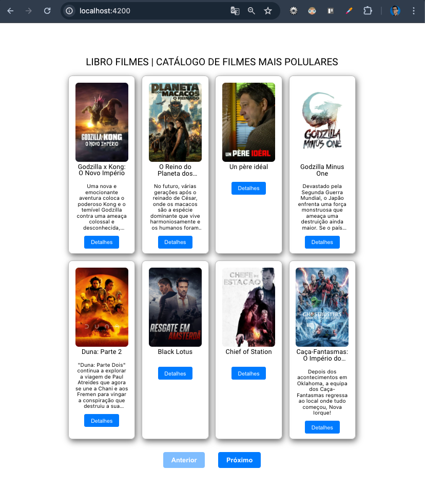
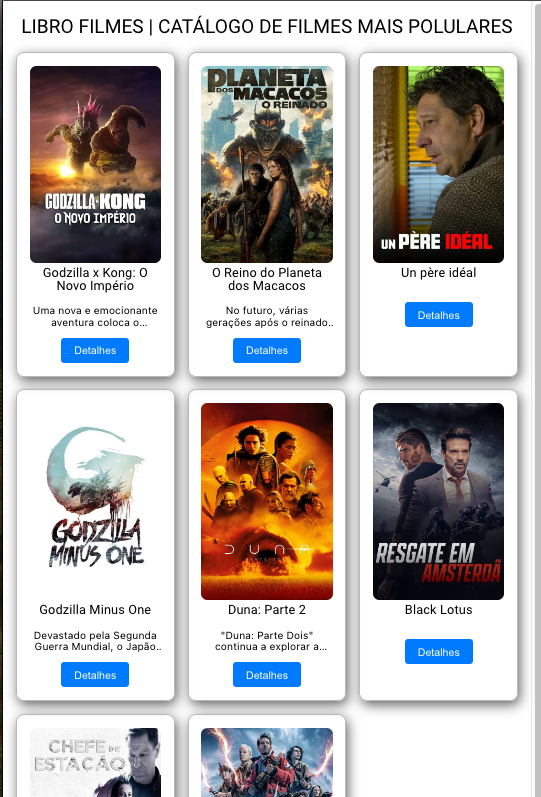
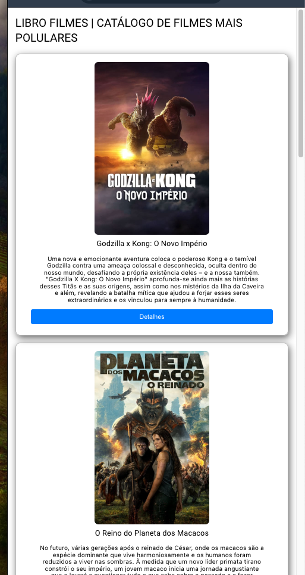
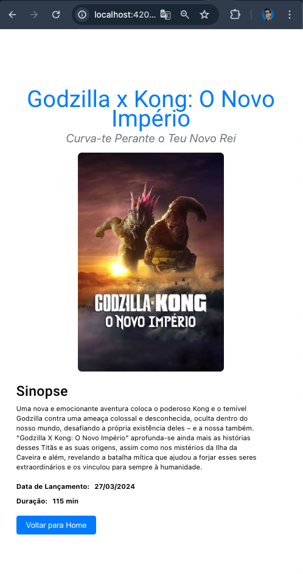

## Descrição

O `film_catalog_angular` é uma aplicação web desenvolvida com Angular que permite aos usuários visualizar uma lista de filmes populares e obter detalhes sobre cada filme. Utiliza a API do The Movie Database (TMDB) para obter informações atualizadas sobre os filmes.

## Telas






## Funcionalidades

- Listagem dos filmes mais populares
- Exibição de detalhes de um filme selecionado
- Navegação entre a lista de filmes e os detalhes de um filme
- Responsividade para diferentes tamanhos de tela
- Incluido formatação de texto para data com o formato 22/05/2024
- Incluido funcionalidade de pagínação

## Requisitos

- [x] Git
- [x] Angular CLI: 17.3.7
- [x] Node: 18.17.0 ou >

## Tecnologias Utilizadas

- Angular
- Angular Material
- TypeScript
- HTML5 e CSS3
- API do The Movie Database (TMDB)

## Estrutura do Projeto

```plaintext
film_catalog_angular/
├── src/
│   ├── app/
│   │   ├── film-list/
│   │   ├── film-detail/
│   │   ├── app-routing.module.ts
│   │   ├── app.component.html
│   │   ├── app.component.ts
│   │   ├── services/
│   │   │      ├── movie.module.ts
│   │   ├── interfaces/
│   │   │      ├── movie.interface.ts
│   ├── assets/
│   ├── environments/
│   ├── index.html
│   ├── styles.css
├── angular.json
├── package.json
├── README.md
└── tsconfig.json
```

## Obs

Nenhuma configuração é necessário. O projeto contem uma chave de api na qual vai expirar em 1 semana. Com isso podem testar a vontade.
